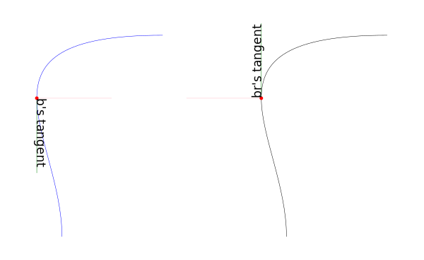
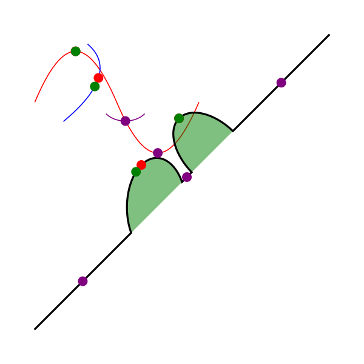
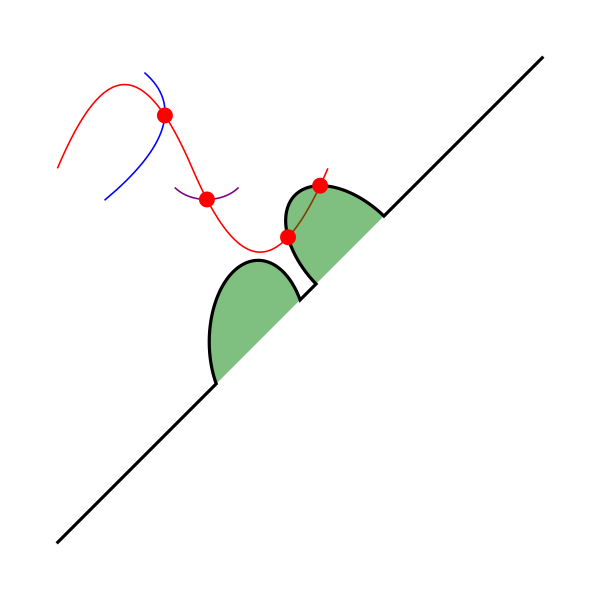

# svgpathtools [](https://www.paypal.com/donate?business=4SKJ27AM4EYYA&amp;no_recurring=0&amp;item_name=Support+the+creator+of+svgpathtools?++He%27s+a+student+and+would+appreciate+it.&amp;currency_code=USD)


svgpathtools is a collection of tools for manipulating and analyzing SVG Path objects and Bézier curves.

## Features

svgpathtools contains functions designed to **easily read, write and display SVG files** as well as *a large selection of geometrically\-oriented tools* to **transform and analyze path elements**.

Additionally, the submodule *bezier.py* contains tools for for working with general **nth order Bezier curves stored as n-tuples**.

Some included tools:

- **read**, **write**, and **display** SVG files containing Path (and other) SVG elements
- convert Bézier path segments to **numpy.poly1d** (polynomial) objects
- convert polynomials (in standard form) to their Bézier form
- compute **tangent vectors** and (right-hand rule) **normal vectors**
- compute **curvature**
- break discontinuous paths into their **continuous subpaths**.
- efficiently compute **intersections** between paths and/or segments
- find a **bounding box** for a path or segment
- **reverse** segment/path orientation
- **crop** and **split** paths and segments
- **smooth** paths (i.e. smooth away kinks to make paths differentiable)
- **transition maps** from path domain to segment domain and back (T2t and t2T)
- compute **area** enclosed by a closed path
- compute **arc length**
- compute **inverse arc length**
- convert RGB color tuples to hexadecimal color strings and back

## Prerequisites
- **numpy**
- **svgwrite**

## Setup

If not already installed, you can **install the prerequisites** using  pip.

```bash
$ pip install numpy
```

```bash
$ pip install svgwrite
```

Then **install svgpathtools**:
```bash
$ pip install svgpathtools
```  
  
### Alternative Setup 
You can download the source from Github and install by using the command (from inside the folder containing setup.py):

```bash
$ python setup.py install
```

## Credit where credit's due
Much of the core of this module was taken from [the svg.path (v2.0) module](https://github.com/regebro/svg.path).  Interested svg.path users should see the compatibility notes at bottom of this readme.

## Basic Usage

### Classes
The svgpathtools module is primarily structured around four path segment classes: ``Line``, ``QuadraticBezier``, ``CubicBezier``, and ``Arc``.  There is also a fifth class, ``Path``, whose objects are sequences of (connected or disconnected<sup id="a1">[1](#f1)</sup>) path segment objects.

* ``Line(start, end)``

* ``Arc(start, radius, rotation, large_arc, sweep, end)``  Note: See docstring for a detailed explanation of these parameters

* ``QuadraticBezier(start, control, end)``

* ``CubicBezier(start, control1, control2, end)``

* ``Path(*segments)``

See the relevant docstrings in *path.py* or the [official SVG specifications](<http://www.w3.org/TR/SVG/paths.html>) for more information on what each parameter means.

<u id="f1">1</u> Warning:  Some of the functionality in this library has not been tested on discontinuous Path objects.  A simple workaround is provided, however, by the ``Path.continuous_subpaths()`` method.    [↩](#a1)


```python
from __future__ import division, print_function
```


```python
# Coordinates are given as points in the complex plane
from svgpathtools import Path, Line, QuadraticBezier, CubicBezier, Arc
seg1 = CubicBezier(300+100j, 100+100j, 200+200j, 200+300j)  # A cubic beginning at (300, 100) and ending at (200, 300)
seg2 = Line(200+300j, 250+350j)  # A line beginning at (200, 300) and ending at (250, 350)
path = Path(seg1, seg2)  # A path traversing the cubic and then the line

# We could alternatively created this Path object using a d-string
from svgpathtools import parse_path
path_alt = parse_path('M 300 100 C 100 100 200 200 200 300 L 250 350')

# Let's check that these two methods are equivalent
print(path)
print(path_alt)
print(path == path_alt)

# On a related note, the Path.d() method returns a Path object's d-string
print(path.d())
print(parse_path(path.d()) == path)
```

    Path(CubicBezier(start=(300+100j), control1=(100+100j), control2=(200+200j), end=(200+300j)),
         Line(start=(200+300j), end=(250+350j)))
    Path(CubicBezier(start=(300+100j), control1=(100+100j), control2=(200+200j), end=(200+300j)),
         Line(start=(200+300j), end=(250+350j)))
    True
    M 300.0,100.0 C 100.0,100.0 200.0,200.0 200.0,300.0 L 250.0,350.0
    True


The ``Path`` class is a mutable sequence, so it behaves much like a list.
So segments can **append**ed, **insert**ed, set by index, **del**eted, **enumerate**d, **slice**d out, etc.


```python
# Let's append another to the end of it
path.append(CubicBezier(250+350j, 275+350j, 250+225j, 200+100j))
print(path)

# Let's replace the first segment with a Line object
path[0] = Line(200+100j, 200+300j)
print(path)

# You may have noticed that this path is connected and now is also closed (i.e. path.start == path.end)
print("path is continuous? ", path.iscontinuous())
print("path is closed? ", path.isclosed())

# The curve the path follows is not, however, smooth (differentiable)
from svgpathtools import kinks, smoothed_path
print("path contains non-differentiable points? ", len(kinks(path)) > 0)

# If we want, we can smooth these out (Experimental and only for line/cubic paths)
# Note:  smoothing will always works (except on 180 degree turns), but you may want 
# to play with the maxjointsize and tightness parameters to get pleasing results
# Note also: smoothing will increase the number of segments in a path
spath = smoothed_path(path)
print("spath contains non-differentiable points? ", len(kinks(spath)) > 0)
print(spath)

# Let's take a quick look at the path and its smoothed relative
# The following commands will open two browser windows to display path and spaths
from svgpathtools import disvg
from time import sleep
disvg(path) 
sleep(1)  # needed when not giving the SVGs unique names (or not using timestamp)
disvg(spath)
print("Notice that path contains {} segments and spath contains {} segments."
      "".format(len(path), len(spath)))
```

    Path(CubicBezier(start=(300+100j), control1=(100+100j), control2=(200+200j), end=(200+300j)),
         Line(start=(200+300j), end=(250+350j)),
         CubicBezier(start=(250+350j), control1=(275+350j), control2=(250+225j), end=(200+100j)))
    Path(Line(start=(200+100j), end=(200+300j)),
         Line(start=(200+300j), end=(250+350j)),
         CubicBezier(start=(250+350j), control1=(275+350j), control2=(250+225j), end=(200+100j)))
    path is continuous?  True
    path is closed?  True
    path contains non-differentiable points?  True
    spath contains non-differentiable points?  False
    Path(Line(start=(200+101.5j), end=(200+298.5j)),
         CubicBezier(start=(200+298.5j), control1=(200+298.505j), control2=(201.057124638+301.057124638j), end=(201.060660172+301.060660172j)),
         Line(start=(201.060660172+301.060660172j), end=(248.939339828+348.939339828j)),
         CubicBezier(start=(248.939339828+348.939339828j), control1=(249.649982143+349.649982143j), control2=(248.995+350j), end=(250+350j)),
         CubicBezier(start=(250+350j), control1=(275+350j), control2=(250+225j), end=(200+100j)),
         CubicBezier(start=(200+100j), control1=(199.62675237+99.0668809257j), control2=(200+100.495j), end=(200+101.5j)))
    Notice that path contains 3 segments and spath contains 6 segments.


### Reading SVGSs

The **svg2paths()** function converts an svgfile to a list of Path objects and a separate list of dictionaries containing the attributes of each said path.  
Note: Line, Polyline, Polygon, and Path SVG elements can all be converted to Path objects using this function.


```python
# Read SVG into a list of path objects and list of dictionaries of attributes 
from svgpathtools import svg2paths, wsvg
paths, attributes = svg2paths('test.svg')

# Update: You can now also extract the svg-attributes by setting
# return_svg_attributes=True, or with the convenience function svg2paths2
from svgpathtools import svg2paths2
paths, attributes, svg_attributes = svg2paths2('test.svg')

# Let's print out the first path object and the color it was in the SVG
# We'll see it is composed of two CubicBezier objects and, in the SVG file it 
# came from, it was red
redpath = paths[0]
redpath_attribs = attributes[0]
print(redpath)
print(redpath_attribs['stroke'])
```

    Path(CubicBezier(start=(10.5+80j), control1=(40+10j), control2=(65+10j), end=(95+80j)),
         CubicBezier(start=(95+80j), control1=(125+150j), control2=(150+150j), end=(180+80j)))
    red


### Writing SVGSs (and some geometric functions and methods)

The **wsvg()** function creates an SVG file from a list of path.  This function can do many things (see docstring in *paths2svg.py* for more information) and is meant to be quick and easy to use.
Note: Use the convenience function **disvg()** (or set 'openinbrowser=True') to automatically attempt to open the created svg file in your default SVG viewer.


```python
# Let's make a new SVG that's identical to the first
wsvg(paths, attributes=attributes, svg_attributes=svg_attributes, filename='output1.svg')
```


There will be many more examples of writing and displaying path data below.

### The .point() method and transitioning between path and path segment parameterizations
SVG Path elements and their segments have official parameterizations.
These parameterizations can be accessed using the ``Path.point()``, ``Line.point()``, ``QuadraticBezier.point()``, ``CubicBezier.point()``, and ``Arc.point()`` methods.
All these parameterizations are defined over the domain 0 <= t <= 1.

**Note:** In this document and in inline documentation and doctrings, I use a capital ``T`` when referring to the parameterization of a Path object and a lower case ``t`` when referring speaking about path segment objects (i.e. Line, QaudraticBezier, CubicBezier, and Arc objects).  
Given a ``T`` value, the ``Path.T2t()`` method can be used to find the corresponding segment index, ``k``, and segment parameter, ``t``, such that ``path.point(T)=path[k].point(t)``.  
There is also a ``Path.t2T()`` method to solve the inverse problem.


```python
# Example:

# Let's check that the first segment of redpath starts 
# at the same point as redpath
firstseg = redpath[0] 
print(redpath.point(0) == firstseg.point(0) == redpath.start == firstseg.start)

# Let's check that the last segment of redpath ends on the same point as redpath
lastseg = redpath[-1] 
print(redpath.point(1) == lastseg.point(1) == redpath.end == lastseg.end)

# This next boolean should return False as redpath is composed multiple segments
print(redpath.point(0.5) == firstseg.point(0.5))

# If we want to figure out which segment of redpoint the 
# point redpath.point(0.5) lands on, we can use the path.T2t() method
k, t = redpath.T2t(0.5)
print(redpath[k].point(t) == redpath.point(0.5))
```

    True
    True
    False
    True


### Bezier curves as NumPy polynomial objects
Another great way to work with the parameterizations for `Line`, `QuadraticBezier`, and `CubicBezier` objects is to convert them to ``numpy.poly1d`` objects.  This is done easily using the ``Line.poly()``, ``QuadraticBezier.poly()`` and ``CubicBezier.poly()`` methods.  
There's also a ``polynomial2bezier()`` function in the pathtools.py submodule to convert polynomials back to Bezier curves.  

**Note:** cubic Bezier curves are parameterized as $$\mathcal{B}(t) = P_0(1-t)^3 + 3P_1(1-t)^2t + 3P_2(1-t)t^2 + P_3t^3$$
where $P_0$, $P_1$, $P_2$, and $P_3$ are the control points ``start``, ``control1``, ``control2``, and ``end``, respectively, that svgpathtools uses to define a CubicBezier object.  The ``CubicBezier.poly()`` method expands this polynomial to its standard form 
$$\mathcal{B}(t) = c_0t^3 + c_1t^2 +c_2t+c3$$
where
$$\begin{bmatrix}c_0\\c_1\\c_2\\c_3\end{bmatrix} = 
\begin{bmatrix}
-1 & 3 & -3 & 1\\
3 & -6 & -3 & 0\\
-3 & 3 & 0 & 0\\
1 & 0 & 0 & 0\\
\end{bmatrix}
\begin{bmatrix}P_0\\P_1\\P_2\\P_3\end{bmatrix}$$  

`QuadraticBezier.poly()` and `Line.poly()` are [defined similarly](https://en.wikipedia.org/wiki/B%C3%A9zier_curve#General_definition).


```python
# Example:
b = CubicBezier(300+100j, 100+100j, 200+200j, 200+300j)
p = b.poly()

# p(t) == b.point(t)
print(p(0.235) == b.point(0.235))

# What is p(t)?  It's just the cubic b written in standard form.  
bpretty = "{}*(1-t)^3 + 3*{}*(1-t)^2*t + 3*{}*(1-t)*t^2 + {}*t^3".format(*b.bpoints())
print("The CubicBezier, b.point(x) = \n\n" + 
      bpretty + "\n\n" + 
      "can be rewritten in standard form as \n\n" +
      str(p).replace('x','t'))
```

    True
    The CubicBezier, b.point(x) = 
    
    (300+100j)*(1-t)^3 + 3*(100+100j)*(1-t)^2*t + 3*(200+200j)*(1-t)*t^2 + (200+300j)*t^3
    
    can be rewritten in standard form as 
    
                    3                2
    (-400 + -100j) t + (900 + 300j) t - 600 t + (300 + 100j)


The ability to convert between Bezier objects to NumPy polynomial objects is very useful.  For starters, we can take turn a list of Bézier segments into a NumPy array 

### Numpy Array operations on Bézier path segments 

[Example available here](https://github.com/mathandy/svgpathtools/blob/master/examples/compute-many-points-quickly-using-numpy-arrays.py) 

To further illustrate the power of being able to convert our Bezier curve objects to numpy.poly1d objects and back, lets compute the unit tangent vector of the above CubicBezier object, b, at t=0.5 in four different ways. 

### Tangent vectors (and more on NumPy polynomials) 


```python
t = 0.5
### Method 1: the easy way
u1 = b.unit_tangent(t)

### Method 2: another easy way 
# Note: This way will fail if it encounters a removable singularity.
u2 = b.derivative(t)/abs(b.derivative(t))

### Method 2: a third easy way 
# Note: This way will also fail if it encounters a removable singularity.
dp = p.deriv() 
u3 = dp(t)/abs(dp(t))

### Method 4: the removable-singularity-proof numpy.poly1d way  
# Note: This is roughly how Method 1 works
from svgpathtools import real, imag, rational_limit
dx, dy = real(dp), imag(dp)  # dp == dx + 1j*dy 
p_mag2 = dx**2 + dy**2  # p_mag2(t) = |p(t)|**2
# Note: abs(dp) isn't a polynomial, but abs(dp)**2 is, and,
#  the limit_{t->t0}[f(t) / abs(f(t))] == 
# sqrt(limit_{t->t0}[f(t)**2 / abs(f(t))**2])
from cmath import sqrt
u4 = sqrt(rational_limit(dp**2, p_mag2, t))

print("unit tangent check:", u1 == u2 == u3 == u4)

# Let's do a visual check
mag = b.length()/4  # so it's not hard to see the tangent line
tangent_line = Line(b.point(t), b.point(t) + mag*u1)
disvg([b, tangent_line], 'bg', nodes=[b.point(t)])
```

    unit tangent check: True


### Translations (shifts), reversing orientation, and normal vectors


```python
# Speaking of tangents, let's add a normal vector to the picture
n = b.normal(t)
normal_line = Line(b.point(t), b.point(t) + mag*n)
disvg([b, tangent_line, normal_line], 'bgp', nodes=[b.point(t)])

# and let's reverse the orientation of b! 
# the tangent and normal lines should be sent to their opposites
br = b.reversed()

# Let's also shift b_r over a bit to the right so we can view it next to b
# The simplest way to do this is br = br.translated(3*mag),  but let's use 
# the .bpoints() instead, which returns a Bezier's control points
br.start, br.control1, br.control2, br.end = [3*mag + bpt for bpt in br.bpoints()]  # 

tangent_line_r = Line(br.point(t), br.point(t) + mag*br.unit_tangent(t))
normal_line_r = Line(br.point(t), br.point(t) + mag*br.normal(t))
wsvg([b, tangent_line, normal_line, br, tangent_line_r, normal_line_r], 
     'bgpkgp', nodes=[b.point(t), br.point(t)], filename='vectorframes.svg', 
     text=["b's tangent", "br's tangent"], text_path=[tangent_line, tangent_line_r])
```



### Rotations and Translations


```python
# Let's take a Line and an Arc and make some pictures
top_half = Arc(start=-1, radius=1+2j, rotation=0, large_arc=1, sweep=1, end=1)
midline = Line(-1.5, 1.5)

# First let's make our ellipse whole
bottom_half = top_half.rotated(180)
decorated_ellipse = Path(top_half, bottom_half)

# Now let's add the decorations
for k in range(12):
    decorated_ellipse.append(midline.rotated(30*k))
    
# Let's move it over so we can see the original Line and Arc object next
# to the final product
decorated_ellipse = decorated_ellipse.translated(4+0j)
wsvg([top_half, midline, decorated_ellipse], filename='decorated_ellipse.svg')
```


### arc length and inverse arc length

Here we'll create an SVG that shows off the parametric and geometric midpoints of the paths from ``test.svg``.  We'll need to compute use the ``Path.length()``, ``Line.length()``, ``QuadraticBezier.length()``, ``CubicBezier.length()``, and ``Arc.length()`` methods, as well as the related inverse arc length methods ``.ilength()`` function to do this.


```python
# First we'll load the path data from the file test.svg
paths, attributes = svg2paths('test.svg')

# Let's mark the parametric midpoint of each segment
# I say "parametric" midpoint because Bezier curves aren't 
# parameterized by arclength 
# If they're also the geometric midpoint, let's mark them
# purple and otherwise we'll mark the geometric midpoint green
min_depth = 5
error = 1e-4
dots = []
ncols = []
nradii = []
for path in paths:
    for seg in path:
        parametric_mid = seg.point(0.5)
        seg_length = seg.length()
        if seg.length(0.5)/seg.length() == 1/2:
            dots += [parametric_mid]
            ncols += ['purple']
            nradii += [5]
        else:
            t_mid = seg.ilength(seg_length/2)
            geo_mid = seg.point(t_mid)
            dots += [parametric_mid, geo_mid]
            ncols += ['red', 'green']
            nradii += [5] * 2

# In 'output2.svg' the paths will retain their original attributes
wsvg(paths, nodes=dots, node_colors=ncols, node_radii=nradii, 
     attributes=attributes, filename='output2.svg')
```



### Intersections between Bezier curves


```python
# Let's find all intersections between redpath and the other 
redpath = paths[0]
redpath_attribs = attributes[0]
intersections = []
for path in paths[1:]:
    for (T1, seg1, t1), (T2, seg2, t2) in redpath.intersect(path):
        intersections.append(redpath.point(T1))
        
disvg(paths, filename='output_intersections.svg', attributes=attributes,
      nodes = intersections, node_radii = [5]*len(intersections))
```



### An Advanced Application:  Offsetting Paths
Here we'll find the [offset curve](https://en.wikipedia.org/wiki/Parallel_curve) for a few paths.


```python
from svgpathtools import parse_path, Line, Path, wsvg
def offset_curve(path, offset_distance, steps=1000):
    """Takes in a Path object, `path`, and a distance,
    `offset_distance`, and outputs an piecewise-linear approximation 
    of the 'parallel' offset curve."""
    nls = []
    for seg in path:
        ct = 1
        for k in range(steps):
            t = k / steps
            offset_vector = offset_distance * seg.normal(t)
            nl = Line(seg.point(t), seg.point(t) + offset_vector)
            nls.append(nl)
    connect_the_dots = [Line(nls[k].end, nls[k+1].end) for k in range(len(nls)-1)]
    if path.isclosed():
        connect_the_dots.append(Line(nls[-1].end, nls[0].end))
    offset_path = Path(*connect_the_dots)
    return offset_path

# Examples:
path1 = parse_path("m 288,600 c -52,-28 -42,-61 0,-97 ")
path2 = parse_path("M 151,395 C 407,485 726.17662,160 634,339").translated(300)
path3 = parse_path("m 117,695 c 237,-7 -103,-146 457,0").translated(500+400j)
paths = [path1, path2, path3]

offset_distances = [10*k for k in range(1,51)]
offset_paths = []
for path in paths:
    for distances in offset_distances:
        offset_paths.append(offset_curve(path, distances))

# Let's take a look
wsvg(paths + offset_paths, 'g'*len(paths) + 'r'*len(offset_paths), filename='offset_curves.svg')
```


## Compatibility Notes for users of svg.path (v2.0)

- renamed Arc.arc attribute as Arc.large_arc

- Path.d() : For behavior similar<sup id="a2">[2](#f2)</sup> to svg.path (v2.0), set both useSandT and use_closed_attrib to be True.

<u id="f2">2</u> The behavior would be identical, but the string formatting used in this method has been changed to use default format (instead of the General format, {:G}), for inceased precision. [↩](#a2)


Licence
-------

This module is under a MIT License.


```python

```
